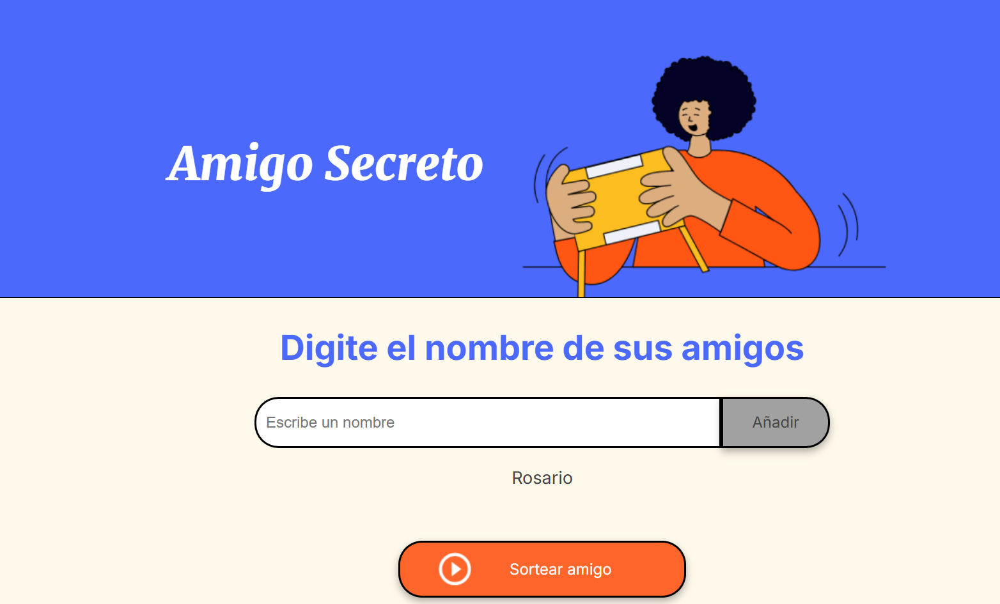
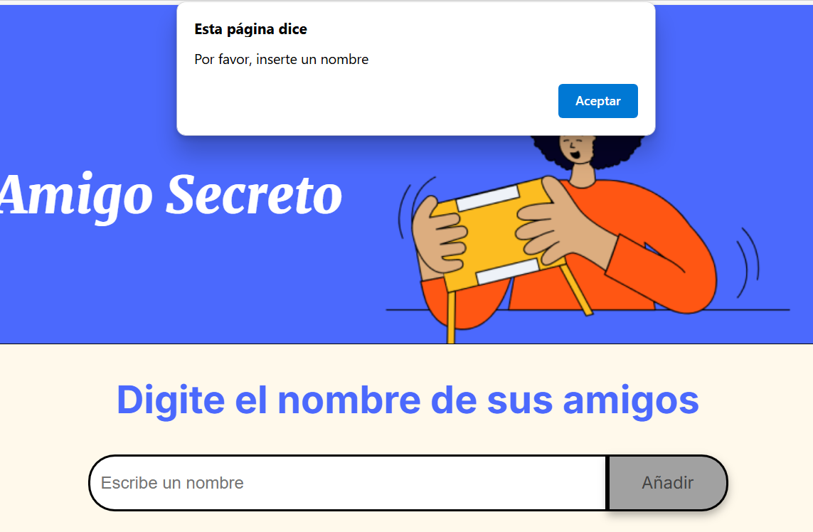
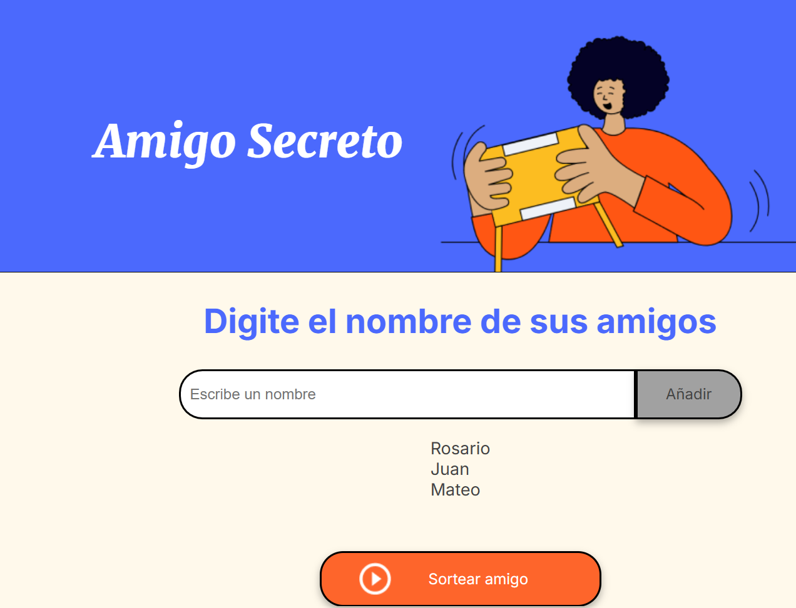
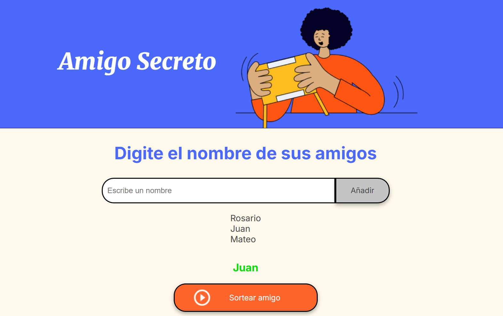

Este es el desafio amigo secreto de Alura 

## Funcionalidades ⚙️

- ✍️**Ingreso de Nombres:** Los usuarios pueden escribir nombres en el campo de texto y presionar **"Añadir"** para agregarlos a la lista.

   

- **Verificación de Entrada:** Si el campo de texto está vacío o contiene caracteres no permitidos, el sistema mostrará una alerta pidiendo un nombre válido.

   

-  **Actualización en Tiempo Real:** Los nombres ingresados aparecerán en una lista que se actualizará automáticamente debajo del campo de entrada.

   

-  **Selección Aleatoria:** Al hacer clic en **"Sortear Amigo"**, el sistema elegirá un nombre aleatoriamente de la lista y lo mostrará en pantalla.

   

